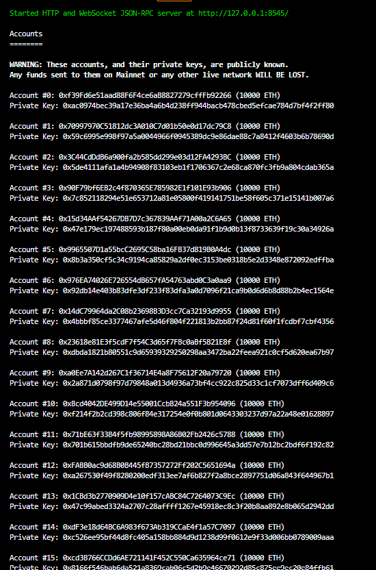
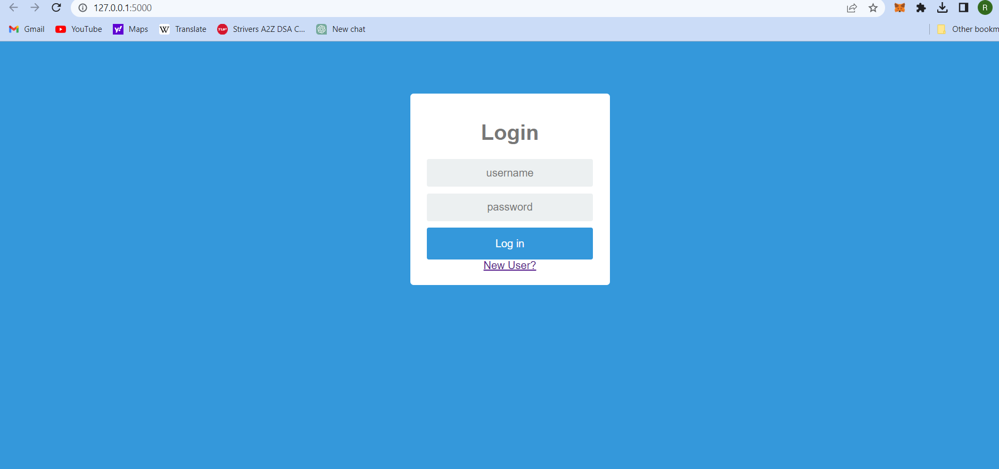

# BLOCKCHAIN BASED RECRUITMENT MANAGEMENT SYSTEM

## Installations

Make sure to install all of the below:
     Nodejs, Hardhat, Web3, Metamask, Flask.

     
      

## Run in the local environment
Run the command
    
        npx hardhat node

You will get some accounts with their private keys.

## Setup Metamask

In order to use the project, you will need Metamask extension install.

In Metamask connect to localhost 8545 network.

Copy the private key from the terminal window where you have launched npx hardhat node.

In metamask select import account and paste the private key.

## Smart Contract

To deploy the smart contract using local hardhat network run the below command

    
        npx hardhat run --network hardhat scripts/deploy.js

## Webapp

Run the command:

    python src/app.py

Open your browser and navigate to localhost:5000

If you have followed all the above instructions carefully you will able to see the below screen.

